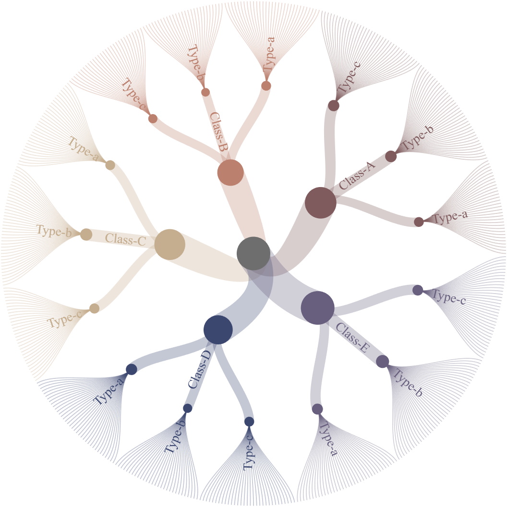
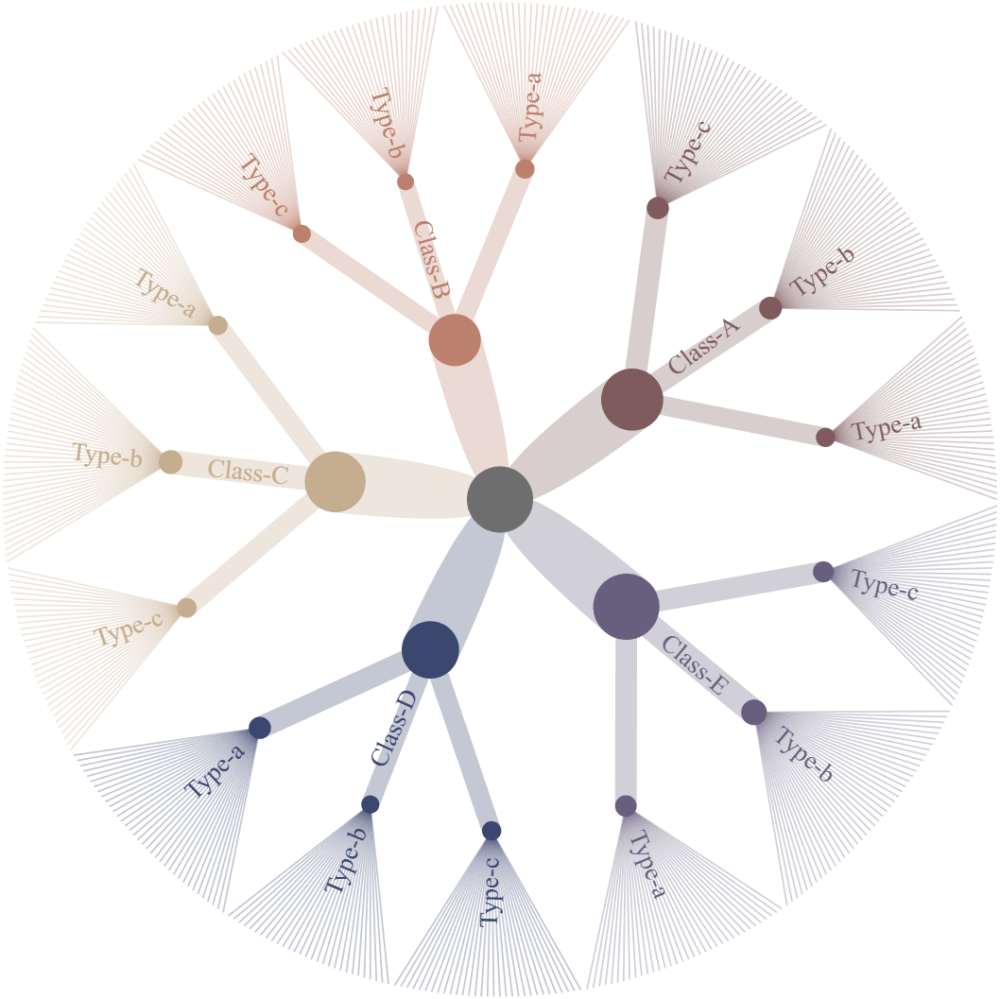
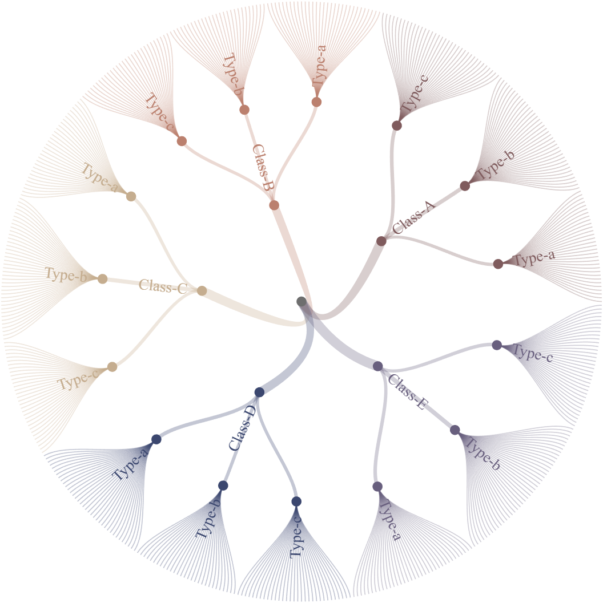
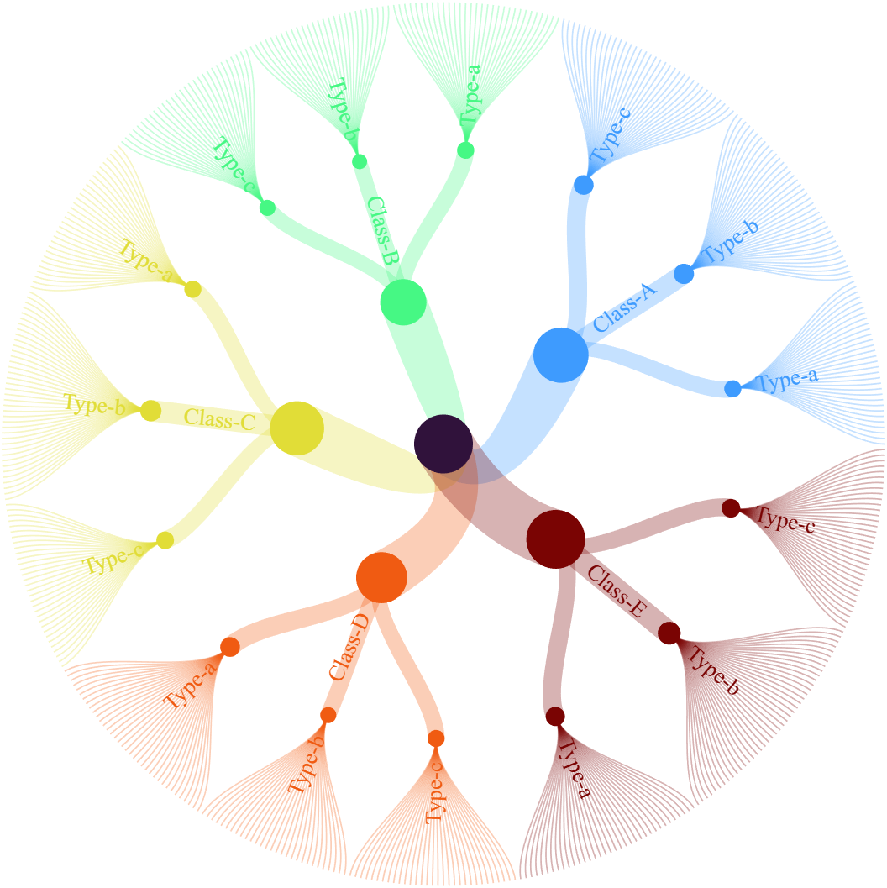
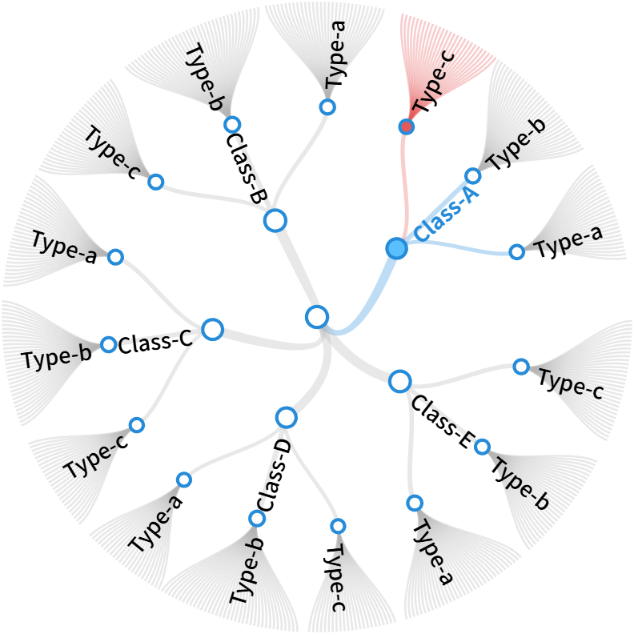
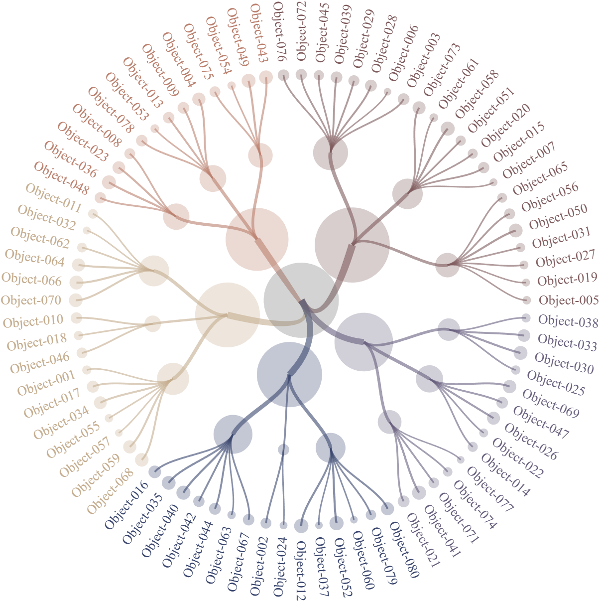
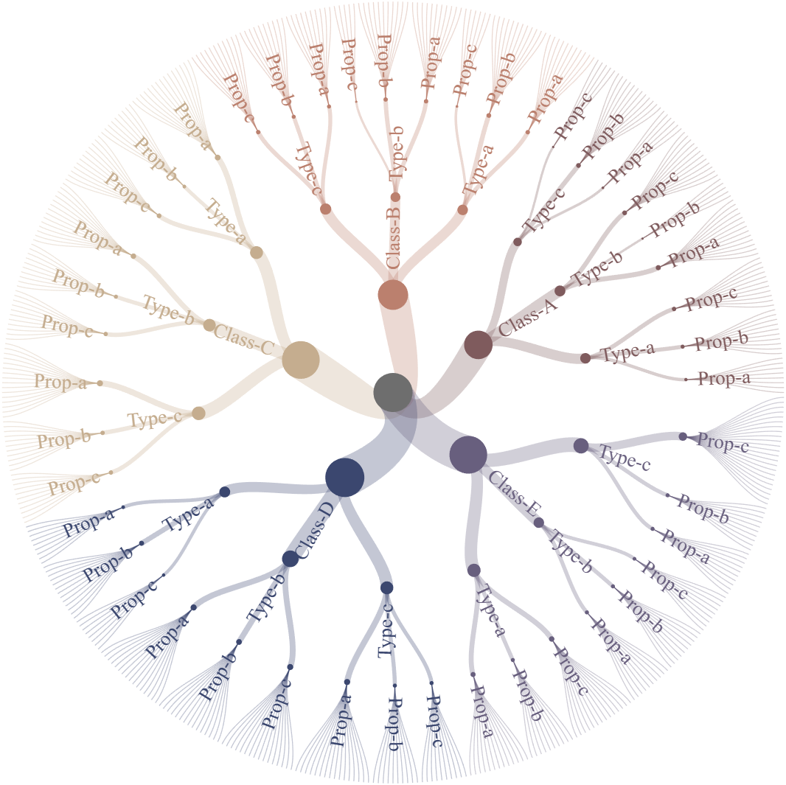
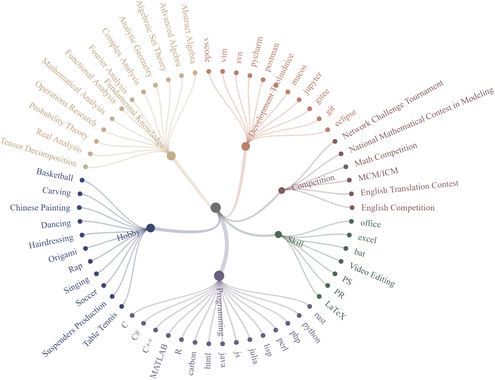

# circular tree chart


## Key features
+ Multi-level hierarchy support
+ Adjustable edge curvature (0-1)
+ Value-based node/edge scaling
+ Customizable colors per category
## Basic usage
```matlab
rng(1)
% Generate random hierarchical dataset (500 items, 3 levels)
ListA = compose('Class-%s', randi([65, 69], [500, 1]));
ListB = compose('Type-%s',  randi([97, 99], [500, 1]));
ListC = compose('Object-%03d', (1:500).');
List  = [ListA, ListB, ListC];
Value = ones(500, 1);
%% Basic usage
figure()
CT1 = circTreeChart(List, 'Value',Value);
CT1.draw;
```

```matlab
%% Curvature control (0 = straight line, 1 = full Bezier curve)
figure()
CT2 = circTreeChart(List, 'Value',Value);
CT2.Curvature = 0;
CT2.draw;
```

```matlab
%% Edge width and node size
figure()
CT3 = circTreeChart(List, 'Value',Value);
% EdgeWidthLim: [min, max] width mapped from Value
% NodeSizeLim:  [min, max] radius mapped from Value
CT3.EdgeWidthLim = [.01, .1];
CT3.NodeSizeLim = [.1, .1];
CT3.draw;
```

```matlab
%% CData
figure()
CT4 = circTreeChart(List, 'Value',Value);
CT4.CData = turbo(6);
CT4.draw;
```

## Properties setting
```matlab
rng(5)
% Generate random hierarchical dataset (500 items, 3 levels)
ListA = compose('Class-%s', randi([65, 69], [500, 1]));
ListB = compose('Type-%s',  randi([97, 99], [500, 1]));
ListC = compose('Object-%03d', (1:500).');
% Introduce missing values
ListA(1:10) = {''};
ListC(1:50) = {''};
List  = [ListA, ListB, ListC];
Value = ones(500, 1);
% Create and configure circular tree chart
CT = circTreeChart(List, 'Value',Value);
CT.EdgeWidthLim = [.02,.1];
CT.NodeSizeLim = [.1,.2];
CT.Curvature = 1;
CT = CT.draw;
% Global style settings
CT.setEdge('FaceColor',[.7,.7,.7])
CT.setLabel('FontName','Monospaced', 'Color','k')
CT.setNode('EdgeColor',[.15,.55,.85], 'LineWidth',2, 'FaceColor','w')
% Customize specific nodes (by layer and index)
CT.setLabelLN(1, 1, 'Color',[.15,.55,.85], 'FontWeight','bold')
CT.setNodeLN(1, 1, 'FaceColor',[.35,.75,1])
% The setColorLN function sets the color of the nth node in the specified layer, 
% as well as the colors of its connections to parent and child nodes.
CT.setColorLN(1, 1, [0.15, 0.55, 0.85])    % Layer1, node1 -> blue
CT.setColorLN(2, 3, [0.9, 0.35, 0.35])     % Layer2, node3 -> red
```

## Bubble-style visualization demo
```matlab
rng(1)
% Generate random hierarchical dataset (500 items, 3 levels)
ListA = compose('Class-%s', randi([65, 69], [80, 1]));
ListB = compose('Type-%s',  randi([97, 99], [80, 1]));
ListC = compose('Object-%03d', (1:80).');
List  = [ListA, ListB, ListC];
Value = rand(80, 1).*100;
% Create and configure circular tree chart
CT = circTreeChart(List, 'Value',Value);
CT.EdgeWidthLim = [.02,.1];
CT.NodeSizeLim = [.1,1];
CT.Curvature = 1;
CT.NodeAlpha = .3;
CT.EdgeAlpha = .6;
CT.DispEndNodes = 'on';
CT.DispEndLabels = 'on';
CT = CT.draw;
for i = 1:length(CT.labelHdl{1})
    set(CT.labelHdl{1}{i}, 'Visible','off')
end
for i = 1:length(CT.labelHdl{2})
    set(CT.labelHdl{2}{i}, 'Visible','off')
end
```

## 4-layer demo
```matlab
ListA = compose('Class-%s', randi([65, 69], [500, 1]));
ListB = compose('Type-%s',  randi([97, 99], [500, 1]));
ListC = compose('Prop-%s',  randi([97, 99], [500, 1]));
ListD = compose('Object-%03d', (1:500).');
List  = [ListA, ListB, ListC, ListD];
CT1 = circTreeChart(List);
CT1.draw
```

## 2-layer demo
```matlab
treeList = {'Competition', 'Math Competition'; 'Competition', 'English Competition';
    'Competition', 'MCM/ICM'; 'Competition', 'National Mathematical Contest in Modeling';
    'Competition', 'Network Challenge Tournament'; 'Competition', 'English Translation Contest';
    'Programming', 'python'; 'Programming', 'MATLAB'; 'Programming', 'C#'; 'Programming', 'C++';
    'Programming', 'C'; 'Programming', 'java'; 'Programming', 'js'; 'Programming', 'R';
    'Programming', 'html'; 'Programming', 'php'; 'Programming', 'rust'; 'Programming', 'julia';
    'Programming', 'perl'; 'Programming', 'carbon'; 'Programming', 'lisp';
    'Skill', 'office'; 'Skill', 'LaTeX'; 'Skill', 'PS'; 'Skill', 'PR';
    'Skill', 'excel'; 'Skill', 'Video Editing'; 'Skill', 'bat';
    'Fundamental Knowledge', 'Algebraic Set Theory'; 'Fundamental Knowledge', 'Fourier Analysis';
    'Fundamental Knowledge', 'Abstract Algebra'; 'Fundamental Knowledge', 'Mathematical Analysis';
    'Fundamental Knowledge', 'Advanced Algebra'; 'Fundamental Knowledge', 'Analytic Geometry';
    'Fundamental Knowledge', 'Real Analysis'; 'Fundamental Knowledge', 'Complex Analysis';
    'Fundamental Knowledge', 'Operations Research'; 'Fundamental Knowledge', 'Functional Analysis';
    'Fundamental Knowledge', 'Tensor Decomposition'; 'Fundamental Knowledge', 'Probability Theory';
    'Development Tool', 'eclipse'; 'Development Tool', 'git'; 'Development Tool', 'gitee';
    'Development Tool', 'jupyter'; 'Development Tool', 'macos'; 'Development Tool', 'postman';
    'Development Tool', 'vscode'; 'Development Tool', 'mdnice'; 'Development Tool', 'pycharm';
    'Development Tool', 'vim'; 'Development Tool', 'svn';
    'Hobby', 'Chinese Painting'; 'Hobby', 'Table Tennis'; 'Hobby', 'Origami';
    'Hobby', 'Carving'; 'Hobby', 'Basketball'; 'Hobby', 'Soccer';
    'Hobby', 'Singing'; 'Hobby', 'Dancing'; 'Hobby', 'Rap';
    'Hobby', 'Suspenders Production'; 'Hobby', 'Hairdressing'};
figure()
CT = circTreeChart(treeList);
CT.DispEndNodes = 'on';
CT.DispEndLabels = 'on';
CT.draw;
```
